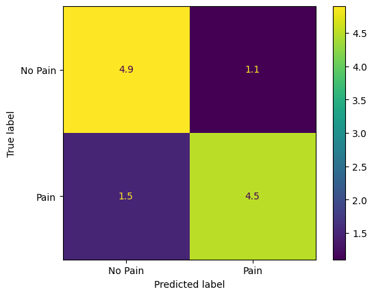

# Pain Classification
---

First we validated our model with more than 6 different models, they are

-   Random Forest

-   Logistic Regression

-   Support vector classifier

-   Decision Trees

-   KNearestNeighbours classifier

-   GaussianNB Classifier

 Now from this , we took the top three performing models and then we had
figured out the best model among them by performing grid search CV.

For Grid search CV, we used the following hyper parameters

param_grid = \[

{\'model\': \[RandomForestClassifier()\],

\'model\_\_n_estimators\': \[10, 100, 1000\],

\'model\_\_max_features\': \[2, 4, 8\],

\'model\_\_max_depth\': \[2, 4, 6, 10\],

\'model\_\_bootstrap\': \[True, False\],

\'model\_\_criterion\': \[\'gini\', \'entropy\'\]

},

{\'model\': \[SVC()\],

\'model\_\_kernel\': \[\'linear\', \'rbf\'\],

\'model\_\_C\': \[0.1, 1, 10,1000\],

\'model\_\_gamma\': \[1, 0.001, 0.0001\],

\'model\_\_degree\': \[1, 2, 3 \]

},

{\'model\': \[KNeighborsClassifier()\],

\'model\_\_n_neighbors\': \[1, 2, 3, 4, 5, 6, 7\],

\'model\_\_weights\': \[\'uniform\', \'distance\'\],

\'model\_\_algorithm\': \[\'auto\', \'ball_tree\', \'kd_tree\',
\'brute\'\],

\# \'model\_\_leaf_size\': \[10, 20, 30, 40, 50, 60\]

}

\]

We tested with more than **272 models** and found out that random forest
performed best with the following hyperparameters

-   *criterion=\'entropy\'*

-   *max_depth=4,*

-   *max_features=4,*

-   *n_estimators=10*

## Best Datatype

WE had classified all the datatypes and compared all of their scores,
out of which **sys** had the highest accuracy and precision

## Best Model

## Physiological Reasoning

A physiological reaction to pain is **a rise in systolic blood
pressure**. This is because the sympathetic nervous system has been
activated, which can result in the production of stress hormones like
noradrenaline and adrenaline. These hormones have the potential to
induce vasoconstriction, which raises blood pressure and increases
resistance to blood flow. Studies have demonstrated that acute
discomfort, like that felt during surgery, can significantly raise
systolic blood pressure. The rise in blood pressure may occasionally be
significant enough to call for medical attention. Blood pressure can
steadily rise as a result of chronic pain disorders like fibromyalgia or
arthritis.

## Metrics of Best model

|            |     Accuracy    |     Precision    |     Recall    |     F1 Score    |
|------------|-----------------|------------------|---------------|-----------------|
|     sys    |     78.45       |     81.66        |     75        |     74.6        |      **74.6**

  --------------------------------------------------------------------------

## Data Fusion
---

Data integration is especially effective in machine learning for the
various reasons. Some of them are

-   Understanding data from various perspectives, Different data sources
- may offer various viewpoints on a problem or occurrence
-   Reduce the Overfitting nature of the model

## Did it have higher accuracy

It had the second highest accuracy and precision, it did not have the
highest accuracy

## Why Didn't it have higher accuracy

It seems out of all input features, the **systolic** pressure was the
most important physiological feature in the given system, so **these
features will be of higher importance** when compared to all the
features fused together, The fusion might increase the overall variance
of the data (more generalization), however it adds non significant data
points to the training space.

# Box Plot
---

## Variance in Data Columns

## Boxplot of features in "sys"

The increased difference in variance of sys values makes this parameter
perform well.

## Higher variance
---

We can see that the **sys** has more variance in the data when compared
to the other data types.

-   More variance means, we should have more differentiating factor between two classes Which can help the model classify the values better

This can be seen from below plot

There is a huge ungoya gap between the no pain and the pain line plots
which makes it easier for the classifier to understand
